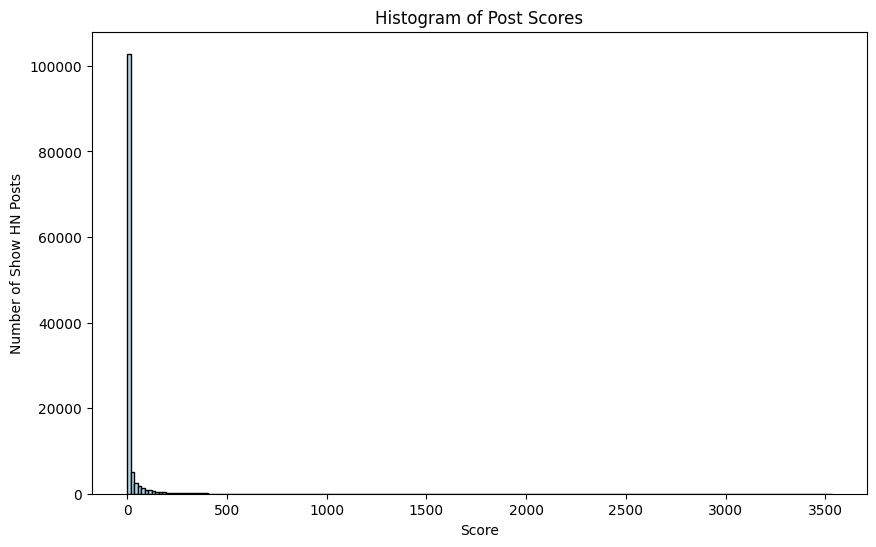
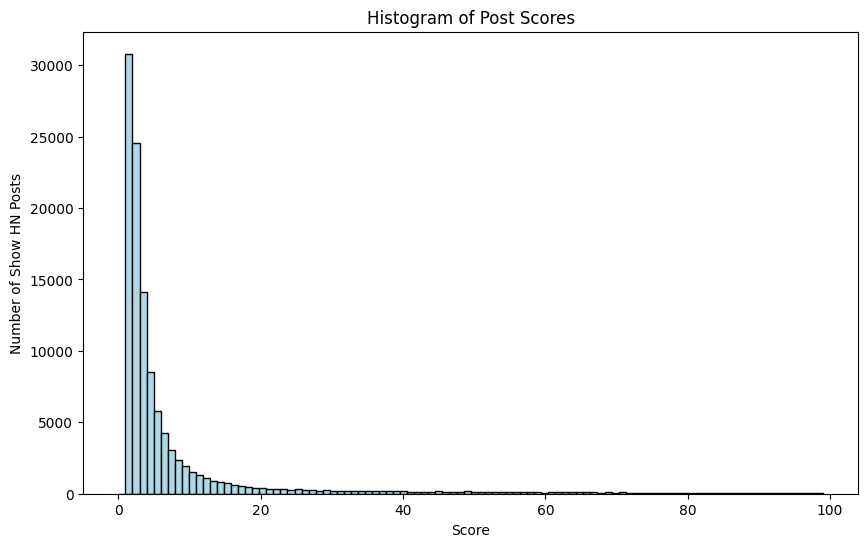
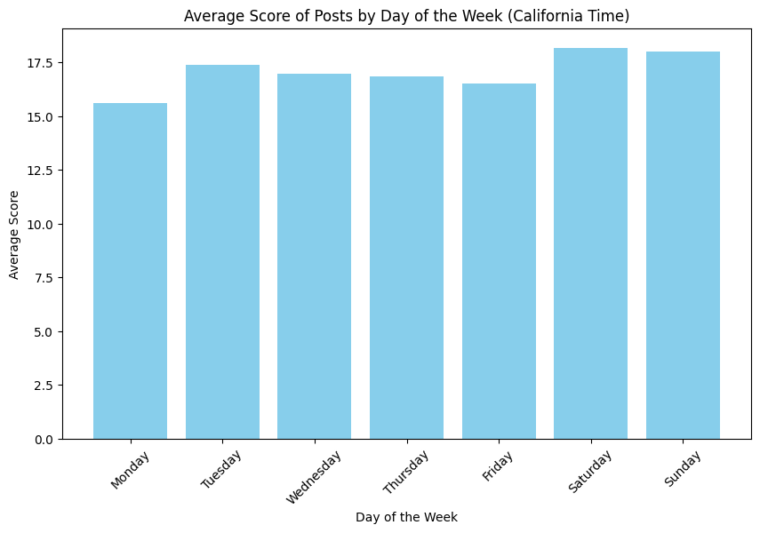
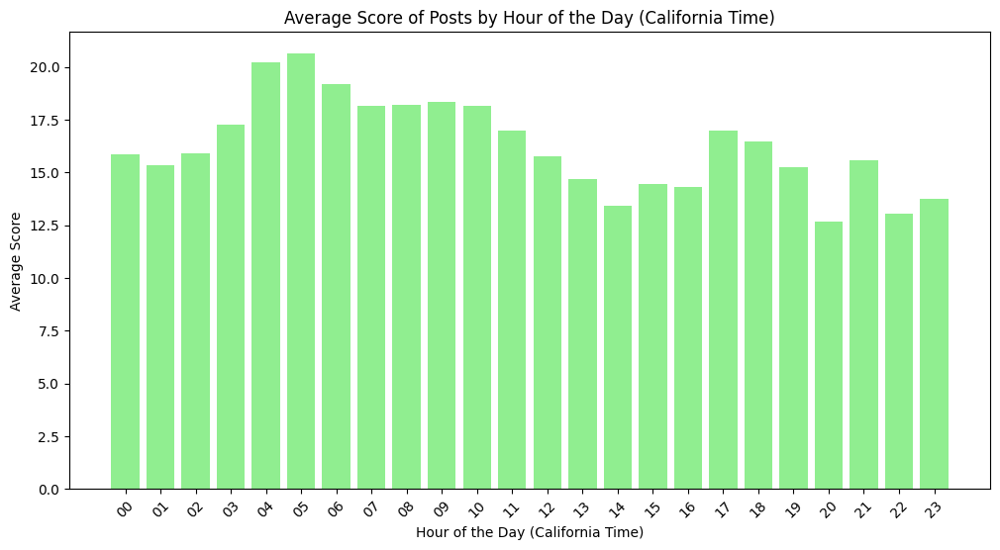
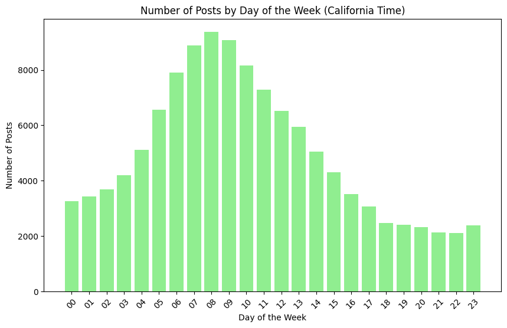
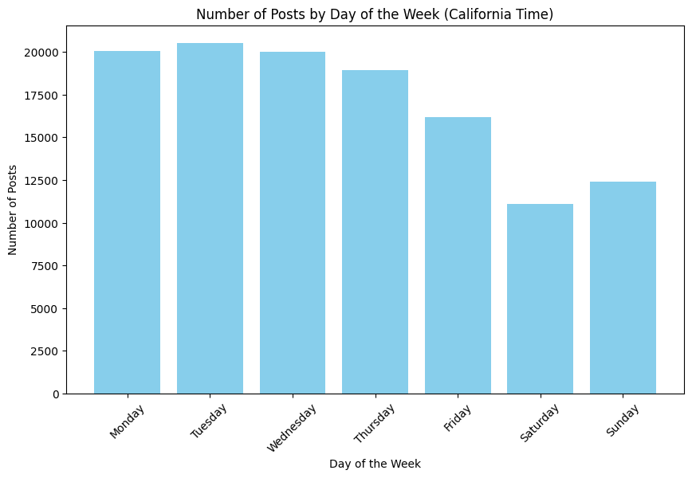
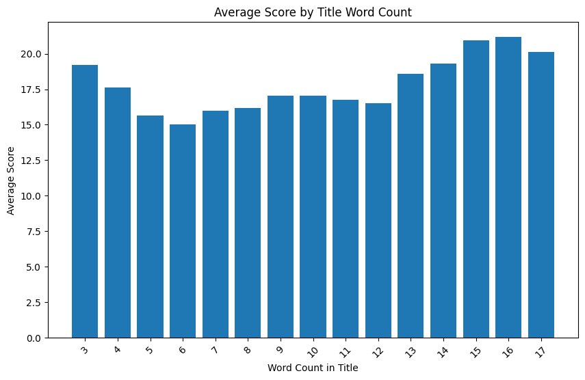
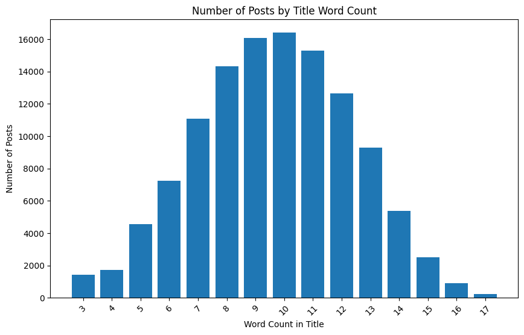

# I analyized 4 millions HN posts and used the tricks I found to get to the top Show HN of the day

## A failed launch

Last week, my friend Stan has built a really cool project pgmock, which is an in-memory postgres written in WebAssembly for unit testing. I have been reading hacker news for a while and I knew this is something that HN people would love. However, when we launched it, it only got 3 upvotes. It was very frustrating and also hard to believe that something like this gets no attention on hackernews just based on my intuition. So I hypothesize is that we didn't launch it correctly.

Then the natural question is: what is a better way to launch? I decided to download the HN post dump and try to find out if there are some patterns. And it was suprising to me that there are some patters that are super obvious and strong.

We launched again and applied some of these tricks. This time it was a huge success and we got more than 300 upvotes within 24 hours and became the top 1 post on Show HN for that day.

If these sound interesting to you, now I am going reveal the tricks.

## Some basic statistics of HN posts

There are around 4 million posts between 2011 and 2022 on hacker news, around 120k of them are Show HN. The average upvotes of posts is 15.2. Show HN generally have more upvotes of an average 17.0.

Since our goal is launch successfully, we mainly focus on Show HN posts from now on. 

The first trick I found is that the Show HN posts with a link have a higher average upvotes of 17.3, compare to the average upvotes of 11.2 for posts without a link. So **always post with a link**

We mentioned before that Show HN posts have an average of 17.0 upvotes, doesn't sound too bad. However, **the median is a painfully low 3.0**. That means half of the posts don't even get more than 3 upvotes and our first launch is already an average launch. That is very sad. If we plot the score distribution, it looks like this:



The power law is so strong you can't even see the data clearly anymore. If we limit the score range from 0 to 100, the power law is still crazy



**Only around 19% of the posts get more than 10 upvotes, 4% get more than 100 upvotes, and 0.8% get more than 300 upvotes.**

One learning from this is that don't be too disappointed if your HN post didn't get any traction, that is actually the most possible outcome.


## Timing

There are some posts on HN saying what is the best time to launch already, but I didn't see any one backing this with data. So I analyized the timing of posts and can confirm that most of the common agreement on the best timing are indeed correct

Here is the average score on which week day you post:



We can see that weekend is inded the best time to post.

If we plot the day time of posts in California PT time, we can also see that posts posted in the morning between 4AM and AM have the highest average score



Even though the common agreement on the HN for best posting time is indeed correct, but no one has given a good explanetion of why these times are better. I will give my best guess on why:

- Why morning is better: This is more of a subjective guess. Most people start their day by reading HN, if you post at that time, it is more likely that you will get intense attention in a short period of time, so it is easier to be ranked better by the algorithm. Also most of the posts are posted between 6AM and 10AM. If you do slightly ealier than them, you will get less competition.



- Why weekend is better: The reason might be relatively simple, it is because the less people post on the weekend, so you have less competition and more likely to get more attention. Here is the graph of number of posts in each weekday:



Conclusion: **Always post on weekend between 4AM and 6AM PT time**

## Title

Now is the most interesting part: what kind of titles are the best? Let's first start from analyzing the length. Here is a plot of the average score of each title word count:

### Title length



We can see that very short and very long titles perform better. The reason for this might be that most posts have a medium length of title, so if you have very short or very long titles, you can stand out more:



Conclusion: **Write titles that are as long as the length limit**

### Title cases

It is quite suprising that all capital lowercase titles (like "This is a title") have a higher average upvotes of 17.5 than all capital uppercase titles (like "This Is A Title") of 14.6. My guess is that HN people are very ads avert and captial uppercase titles give people a marketing vibe.

Conclusion: **Write lower-cased titles**

### Title keywords

One pattern I noticed when browsing hacker news is that it seems like posts with "I built ..." or "I ..." have more stars than normal posts. Is that really the case? I ran an analysis and suprisingly, **Show HN posts with "I" in it has a much higher average upvotes of 34.4 instead of 17.0.** This is an increadabily large advantage.

So what are all the words that gives much higher average upvotes? I lemmatized all the words and counted the average scores of all lemmas that has more than 100 occurance. And this is the list of words:

```
```