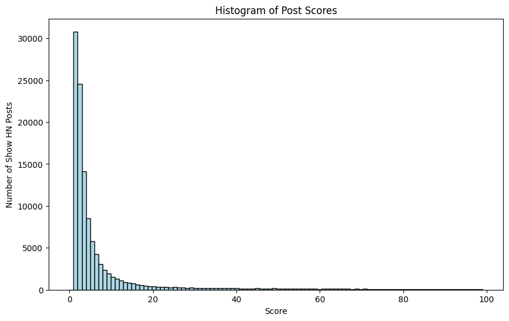

# I Analyzed 4 Million HN Posts, and Here’s What I Found

## A Failed Launch

Last week, my friend Konsti built a really cool project called [pgmock](https://github.com/stack-auth/pgmock), an in-memory Postgres written in WebAssembly for unit testing. Having followed Hacker News (HN) for quite some time, I was confident this was something the HN community would love. However, when we launched it, it only garnered 3 upvotes (2 from ourselves). This was frustrating and hard to believe. Based on my intuition, this kind of project should have gained more attention. So, I hypothesized that we didn’t launch it correctly.

The natural question then was: what is a better way to launch? I decided to download the HN post dump and analyze it to see if there were any patterns. Surprisingly, I found some that were quite obvious and strong.

We relaunched, applying some of these tricks. This time, it was a huge success, and we received more than 300 upvotes within 24 hours, making it the top post on Show HN for the day.

That gave us a lot of confidence and motivation, we also relaunched our main project [Stack Auth](https://github.com/stack-auth/stack), which previously only got 2 upvotes, and it also became one of the top posts on Show HN for the day with 150+ upvotes.

Here are the HN posts if you are curious:
- [pgmock, 2 upvotes](https://news.ycombinator.com/item?id=39928215)
- [pgmock, 379 upvotes](https://news.ycombinator.com/item?id=39960537)
- [Stack Auth, 3 upvotes](https://news.ycombinator.com/item?id=41092942)
- [Stack Auth, 144 upvotes](https://news.ycombinator.com/item?id=40031090)

## Some Basic Statistics of HN Posts

There were around 4 million posts on Hacker News between 2011 and 2022, with around 120k of them being Show HN posts. The average number of upvotes for posts is 15.2, and Show HN posts generally have more, averaging 17.0. (**Remember the number 17.0** as everything later will be compared to it.)

Since our goal is to launch successfully, we will mainly focus on Show HN posts from now on.

The first trick I discovered is that Show HN posts with a link have a higher average number of upvotes (17.3) compared to those without a link (11.2). So, **always post with a link**.

The average of 17.0 doesn’t sound too bad. However, **the median is a painfully low 3.0**. This means half of the posts don't get more than 3 upvotes, signifying our first launch was actually average. That’s quite disheartening. If we plot the score distribution, it looks like this:


The power law is so strong you can’t even see the data clearly anymore. If we limit the score range from 0 to 100, the power law remains extreme:



**Only around 19% of posts get more than 10 upvotes, 4% get more than 100 upvotes, and 0.8% get more than 300 upvotes.**

One takeaway from this is not to be too disappointed if your HN post doesn't gain traction—this is actually the most likely outcome.

## Timing

There are some existing posts on HN discussing the best time to launch, but few back this up with data. I analyzed the timing of posts and can confirm that most conventional wisdom about the best timing is indeed correct.

Here’s the average score by the day of the week you post:


We can see that weekends are indeed the best time to post.

If we plot the time of day for posts in California PT time, we can also observe that posts published in the early morning between 4 AM and 6 AM have the highest average scores:


Though the common agreement on HN’s best posting time is likely correct, no one has provided a good explanation for why these times are better. Here is my best guess:

- **Why mornings are better**: This is more of a subjective guess. Most people start their day by reading HN; if you post at that time, you’re more likely to get intense attention in a short period, which can result in better ranking by the algorithm. Also, most posts are made between 6 AM and 10 AM. If you post slightly earlier, you’ll face less competition.

  

- **Why weekends are better**: The reason might be simple. Fewer people post on the weekends, so you face less competition and are more likely to get noticed. Here’s the graph of the number of posts each weekday:

  

Conclusion: **Always post on weekends between 4 AM and 6 AM PT time.**

## Title

Now for the most interesting part: what kind of titles work best? Let’s start by analyzing the length. Here’s a plot of the average score for each title word count:

### Title Length


We can see that both very short and very long titles perform better. The reason might be that most posts have a medium-length title, so having a very short or very long title helps you stand out more:


The longer titles are easier to write and generally have slightly higher average scores, so my recommendation is to just max out the title length.

Conclusion: **Write titles that are as long as the length limit.**

### Title Case

Interestingly, all-lowercase titles (e.g., "this is a title") have higher average upvotes (17.5) than titles using title case (e.g., "This Is A Title"), which average 14.6 upvotes. My guess is that HN users are averse to ads, and title-case titles give a marketing vibe.

Conclusion: **Write lowercase titles.**

### Keywords in Titles

Browsing HN, it seemed like posts with phrases like "I built ..." or "I ..." received more upvotes. Testing this hypothesis revealed that **Show HN posts containing "I" have much higher average upvotes (34.4) compared to the overall average (17.0).** This is a significant advantage.

So what are some other words that correlate with higher average upvotes? I lemmatized all the words and calculated the average scores of lemmas with more than 100 occurrences. Here’s the top 20 list of words:

```
Top 100 words by average score (word, avg_score, number_of_occurrences):
im 48.46 304
wrote 45.00 325
altern 43.30 977
year 41.27 404
opensourc 40.01 1451
linux 37.60 429
simul 35.67 463
i 34.36 4681
brows 31.61 323
book 30.42 1031
sql 30.06 428
modern 29.99 467
pdf 29.52 476
made 28.85 2746
faster 28.84 388
css 28.76 755
html5 28.35 430
program 28.30 1051
termin 27.82 690
editor 27.70 835
```

Let’s group the top words into a few categories:
- `im (I'm)`, `wrote`, `i`, `made`, `year`: These are all about storytelling and "building something." "Year" is mostly used in phrases like "I have been working on this for X years." HN is a place for indie hackers, and people love these stories.
- `altern (alternative)`, `opensourc (open-source)`: As we all know, HN loves open-source projects.
- `modern`, `faster`: Properties that HN developers appreciate.
- `linux`, `css`, `html5`, `sql`, `termin (terminal)`, `editor`, `simul (simulator)`: Technologies that HN users love.

You can already see a clear pattern here, which also matches my intuition. When creating a new title, try to incorporate as many of these words as possible.

### Bad Keywords in Titles

What about the reverse? Are there any words negatively correlated with the average score? Here’s the bottom 20 list of words:

```
Bottom 20 words by average score (word, avg_score, number_of_occurrences):
anoth 6.22 358
instagram 6.23 323
crypto 6.27 437
quick 6.90 314
updat 6.91 477
feedback 7.16 793
tweet 7.37 436
modul 7.45 310
beta 7.86 464
wordpress 7.94 336
plugin 8.01 782
android 8.07 1426
event 8.11 534
click 8.58 332
notif 8.59 437
feed 8.61 459
swift 8.63 362
start 8.67 396
java 8.88 475
aggreg 8.94 397
busi 9.01 670
```

Let’s group these bottom words into a few categories:
- `anoth (another)`, `update`, `beta`, `plugin`: Bore, no one cares; just another company trying to use HN for random stuff (interestingly, `another` is very similar to one of the top words, `alternative`. I guess the difference is that `another` implies doing the same thing, while `alternative` suggests doing something different, and is often linked with open-source).
- `instagram`, `tweet`, `notif (notification)`, `feed`: Social media-related words.
- `crypto`, `swift`, `java`, `android`, `wordpress`: Older technologies that HN users don’t favor.

So, try to avoid these words in your title.

## Conclusion
- **HN is a tough place to launch, don't be too disappointed if your post doesn't gain traction.**
- **Always post with a link.**
- **Always post on weekends between 4 AM and 6 AM PT time.**
- **Write titles that are as long as the length limit.**
- **Write lowercase titles.**
- **Use keywords like "I," "open-source," "alternative," and "modern" in your titles.**
- **Avoid boring words like "another," "update," "beta," and "plugin."**

## Some Notes:
The analysis was not very rigorous, for example everything is calculated based on average score, which is very easily skewed by outliers. Also, the data is from 2011 to 2022, and I didn't do any time series analysis, so the results might not be up-to-date.


## Appendix
the top 100 and bottom 100 words by average score:

```
Top 100 stems by average score(stem, avg_score, num_occurence):
im 48.45723684210526 304
wrote 45.00923076923077 325
altern 43.29887410440123 977
year 41.26732673267327 404
opensourc 40.01171605789111 1451
linux 37.5967365967366 429
simul 35.66522678185745 463
i 34.36167485580004 4681
brows 31.606811145510836 323
book 30.422890397672163 1031
sql 30.05841121495327 428
modern 29.99357601713062 467
pdf 29.516806722689076 476
made 28.853241077931536 2746
faster 28.837628865979383 388
css 28.764238410596025 755
html5 28.348837209302324 430
program 28.30256898192198 1051
termin 27.821739130434782 690
editor 27.70179640718563 835
hacker 27.60766283524904 1305
databas 27.451487710219922 773
languag 26.92922794117647 1088
’ 26.92128279883382 343
algorithm 26.5 382
thi 26.41343669250646 774
3d 26.148529411764706 680
comput 26.10955710955711 429
where 25.986263736263737 364
built 25.984189723320156 2530
markdown 25.577319587628867 582
puzzl 25.47147147147147 333
color 25.29136690647482 556
ui 25.24869109947644 764
turn 25.241726618705037 695
webgl 25.00920245398773 326
look 24.96398891966759 361
deep 24.781094527363184 402
who 24.569190600522195 383
server 24.536941580756015 1164
fast 24.52421959095802 929
c 24.486140724946694 938
engin 24.48249027237354 1542
instant 24.46969696969697 330
tini 24.412371134020617 388
rust 24.41222366710013 769
10 24.411078717201168 343
written 24.320121951219512 984
web 24.240506329113924 3713
privat 24.201044386422975 383
os 24.143712574850298 334
cours 24.107954545454547 352
learn 24.085054080629302 2034
git 23.91283676703645 631
interact 23.859066427289047 1114
us 23.659442724458206 323
minim 23.64066193853428 423
static 23.57676348547718 482
anim 23.570434782608697 575
stock 23.371681415929203 339
minimalist 23.226044226044227 407
an 23.18394587675992 5469
work 23.095281306715062 1102
not 23.035714285714285 420
stack 23.013333333333332 375
no 22.98005698005698 702
compil 22.87319884726225 347
site 22.799185888738126 1474
encrypt 22.753424657534246 511
distribut 22.74660633484163 442
but 22.59360730593607 438
nativ 22.554982817869416 582
edit 22.526806526806528 429
game 22.513951979234264 3082
shell 22.493865030674847 326
reddit 22.48131868131868 455
open 22.36896046852123 2049
visual 22.363581367211133 1653
bootstrap 22.358974358974358 351
browser 22.34550408719346 1835
write 22.331189710610932 933
maco 22.13235294117647 408
minut 21.932608695652174 460
text 21.868306801736615 1382
render 21.82747603833866 313
side 21.746963562753038 494
have 21.700808625336926 371
my 21.63968734241049 3966
a 21.619241923517908 29654
make 21.562937062937063 1716
hack 21.494529540481402 457
desktop 21.478527607361965 489
sourc 21.448827292110874 1876
queri 21.401515151515152 396
type 21.287378640776698 515
it 21.194331983805668 1235
– 21.188303244730715 33069
lightweight 21.187772925764193 458
machin 21.17655172413793 725
javascript 21.147673314339983 2106
```

```
Bottom 100 stems by average score (stem, avg_score, num_occurence):
anoth 6.220670391061453 358
instagram 6.232198142414861 323
crypto 6.267734553775743 437
quick 6.901273885350318 314
updat 6.9077568134171905 477
feedback 7.157629255989912 793
tweet 7.3692660550458715 436
modul 7.451612903225806 310
beta 7.859913793103448 464
wordpress 7.9375 336
plugin 8.006393861892583 782
android 8.068723702664796 1426
event 8.114232209737828 534
click 8.58433734939759 332
notif 8.585812356979405 437
feed 8.60566448801743 459
swift 8.629834254143647 362
start 8.669191919191919 396
java 8.875789473684211 475
aggreg 8.937027707808564 397
busi 9.008955223880598 670
newslett 9.068649885583524 437
review 9.125850340136054 588
templat 9.189907038512617 753
golang 9.191747572815533 412
resourc 9.268518518518519 432
util 9.327543424317618 403
media 9.39406779661017 472
php 9.414868105515588 417
state 9.438943894389439 303
facebook 9.447140381282496 577
slack 9.455542021924483 821
integr 9.467455621301776 507
io 9.489739323349973 1803
content 9.64033850493653 709
link 9.686206896551724 870
twitter 9.865736704446382 1147
place 9.895038167938932 524
improv 9.91139240506329 395
messag 9.918508287292818 724
schedul 9.982558139534884 344
stori 10.080078125 512
packag 10.203866432337435 569
group 10.230179028132993 391
launch 10.339791356184799 671
tracker 10.34516765285996 507
chrome 10.370113493064313 1586
task 10.387523629489603 529
track 10.403614457831326 1328
rate 10.468656716417911 335
chang 10.581632653061224 392
password 10.587064676616915 402
organ 10.603092783505154 388
keep 10.635910224438902 401
custom 10.711453744493392 908
multipl 10.800554016620499 361
quickli 10.820754716981131 318
fun 10.845930232558139 344
team 10.938478747203579 894
report 10.991404011461318 349
typescript 11.085959885386819 349
test 11.103148024112524 1493
featur 11.151709401709402 468
experi 11.15625 480
saa 11.187203791469194 422
market 11.187617260787993 533
monitor 11.265330188679245 848
rest 11.30316742081448 442
send 11.305810397553516 654
dynam 11.326860841423947 309
social 11.453125 1280
need 11.455188679245284 424
more 11.672289156626507 830
request 11.675355450236967 422
random 11.75794621026895 409
via 11.763684913217624 749
analysi 11.81140350877193 456
rail 11.883190883190883 351
mobil 11.958650707290532 919
curat 11.958925750394945 633
bot 11.983164983164983 891
extens 12.118320610687023 1834
easili 12.123511904761905 672
locat 12.173374613003096 323
take 12.19128329297821 413
convers 12.222873900293255 341
price 12.274089935760172 467
add 12.310526315789474 570
list 12.33030303030303 1320
nodej 12.373247033441208 927
cloud 12.376288659793815 970
cli 12.413502109704641 948
tech 12.41653666146646 641
get 12.451810584958217 1795
travel 12.506702412868632 373
share 12.553113553113553 1911
view 12.600431965442764 463
startup 12.609096901779829 1517
docker 12.624012638230647 633
digit 12.629191321499015 507
```
